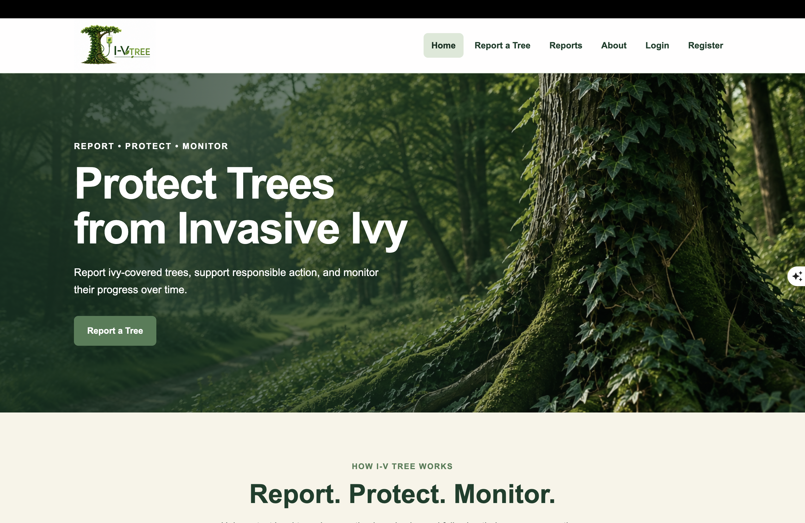
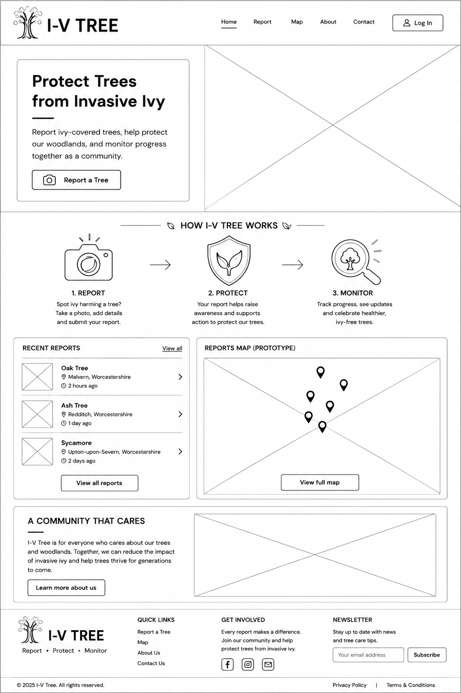
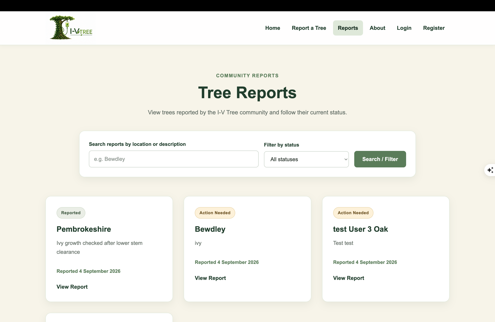
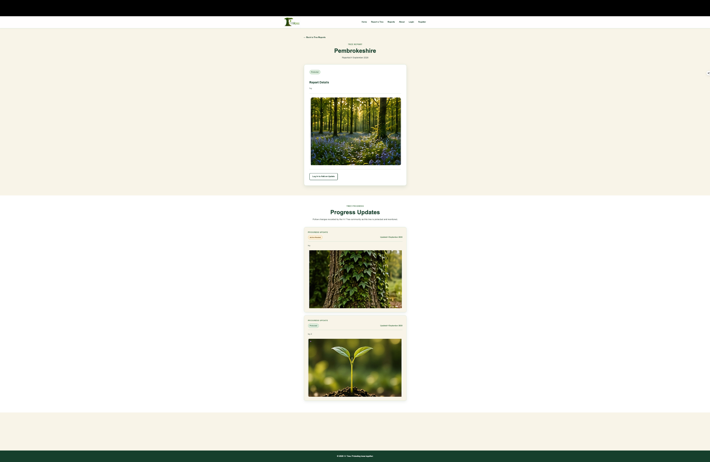
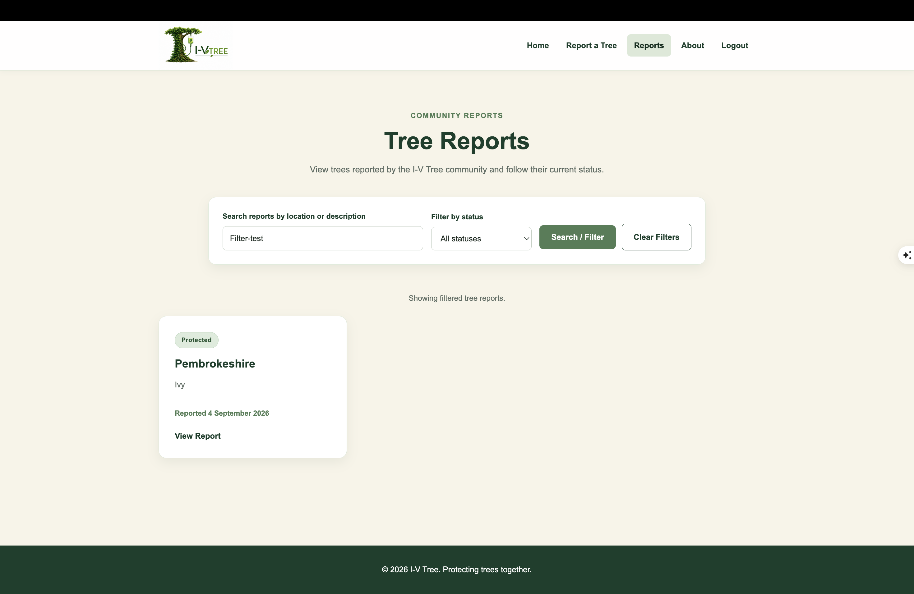
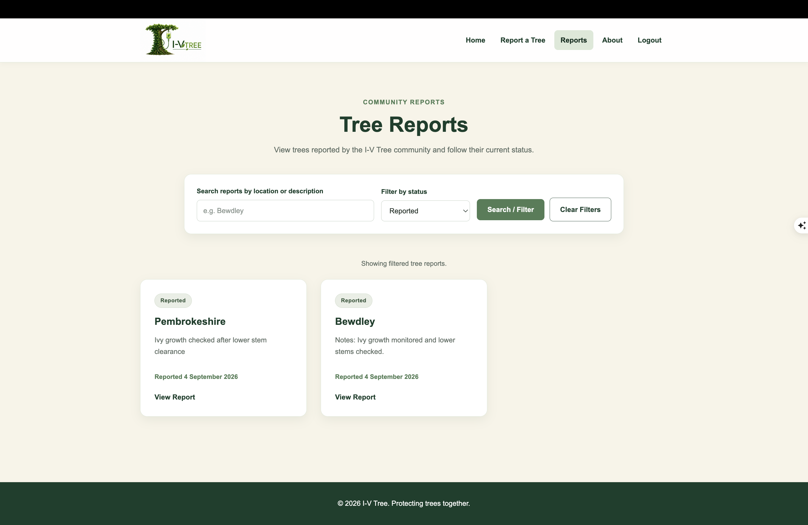
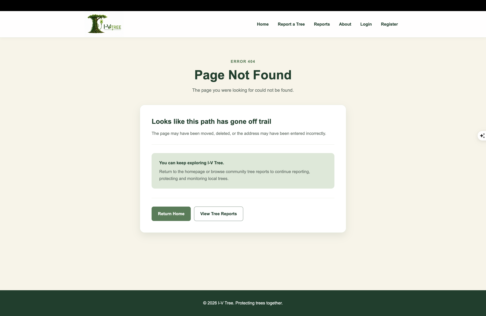
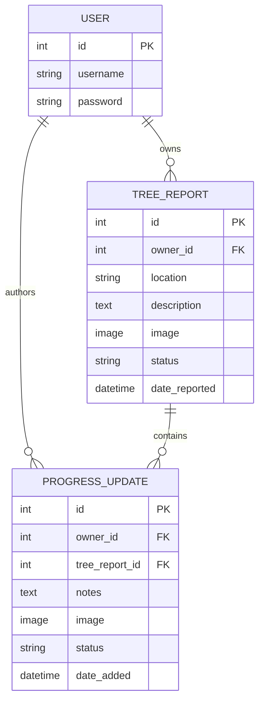
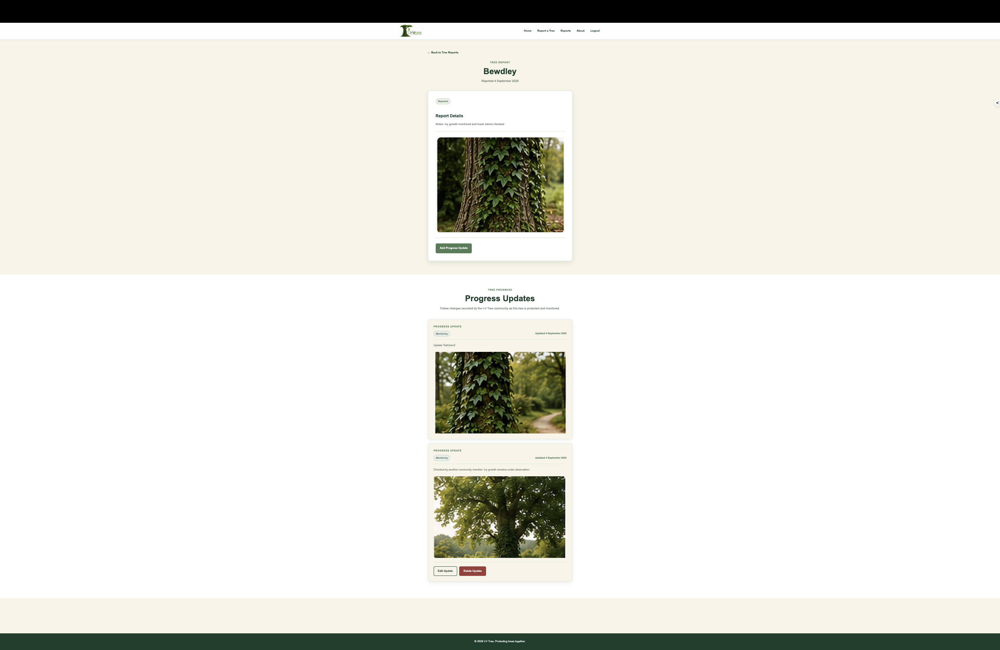

# I-V Tree

I-V Tree is a full-stack conservation web application that allows communities to report trees affected by invasive ivy, follow their progress and record how their condition changes over time.

The application was developed as a Back End Development project using Django and a relational database. It combines a responsive public-facing interface with authenticated data creation and ownership controls.

The central idea is simple:

**Report. Protect. Monitor.**

A tree can first be reported, then followed through a series of community progress updates. The application's current-status logic keeps the main report aligned with its latest update while retaining earlier updates as a historical record.

## Live Project

- [View the deployed I-V Tree application](https://allyharperoverton.pythonanywhere.com/)
- [View the GitHub repository](https://github.com/starearthrocket/iv-tree-v2)



---

## Table of Contents

1. [Project Purpose](#project-purpose)
2. [Target Audience](#target-audience)
3. [User Stories](#user-stories)
4. [UX and Design](#ux-and-design)
5. [Features](#features)
6. [Data Model](#data-model)
7. [CRUD Functionality](#crud-functionality)
8. [Current Status and Progress History](#current-status-and-progress-history)
9. [Search and Filtering](#search-and-filtering)
10. [Authentication and Permissions](#authentication-and-permissions)
11. [Accessibility](#accessibility)
12. [Responsive Design](#responsive-design)
13. [Technologies Used](#technologies-used)
14. [Project Structure](#project-structure)
15. [Testing](#testing)
16. [Validation](#validation)
17. [Bugs and Fixes](#bugs-and-fixes)
18. [Deployment](#deployment)
19. [Security](#security)
20. [Version Control](#version-control)
21. [Known Limitations](#known-limitations)
22. [Future Development](#future-development)
23. [Credits and Attribution](#credits-and-attribution)

---

## Project Purpose

I-V Tree was designed around a real-world conservation problem: trees that become heavily affected by invasive ivy can benefit from being identified, monitored and revisited over time.

A simple one-off reporting system would record only the original observation. I wanted I-V Tree to go further by allowing the community to return to an existing report and record what has happened since.

The application therefore separates:

- the original **Tree Report**;
- the tree's **current status**;
- and a chronological history of **Progress Updates**.

This creates a clearer picture of each reported tree while demonstrating meaningful relational data management.

The project is an original concept and was not created as a copy of a course walkthrough application.

---

## Target Audience

I-V Tree is intended for people with an interest in local trees, woodland conservation and community environmental action.

The target audience includes:

- residents who notice trees affected by invasive ivy;
- conservation volunteers;
- woodland and countryside groups;
- community members checking previously reported trees;
- users who want to record changes without needing ownership of the original report.

The interface was deliberately kept simple so that a user does not need specialist ecological or technical knowledge to understand the core workflow.

---

## User Stories

| User | User Story | Implementation |
| --- | --- | --- |
| Visitor | As a visitor, I want to understand the purpose of I-V Tree immediately. | Homepage hero and Report / Protect / Monitor content explain the application. |
| Visitor | As a visitor, I want to browse existing tree reports without creating an account. | Reports list and report-detail pages are publicly accessible. |
| Visitor | As a visitor, I want to search for relevant reports. | Search covers report locations, original descriptions and related progress-update notes. |
| Visitor | As a visitor, I want to narrow reports by their current status. | Status filter supports Reported, Action Needed, Protected and Monitoring. |
| Visitor | As a visitor, I want to see how a reported tree has changed. | Each report detail page shows its related progress-update history. |
| Visitor | As a visitor, I want to create an account when I want to contribute. | Registration and login functionality are provided using Django authentication. |
| Registered user | As a registered user, I want to submit a new tree report. | Authenticated users can create reports with a location, description and optional image. |
| Registered user | As a registered user, I want to add information to another community member's report. | Any authenticated user can add a Progress Update to an existing Tree Report. |
| Report owner | As a report owner, I want to correct or remove my own report. | Owners can edit and delete their Tree Reports. |
| Update owner | As an update owner, I want to correct or remove my own progress update. | Owners can edit and delete their Progress Updates. |
| User | As a user, I want destructive actions to be clear before they happen. | Delete actions use dedicated confirmation pages. |
| User | As a user, I want feedback after changing data. | Django messages confirm successful and unsuccessful actions. |
| User | As a user, I want the latest information to be reflected by the report status. | Adding or editing the latest update updates the Tree Report's current status. |
| User | As a user, I want historical progress to remain meaningful. | Editing an older update does not overwrite the status from a newer update. |
| User | As a user, I want a report to recover its previous state if its latest update is removed. | Deleting the newest update restores the preceding update's status, or Reported if no updates remain. |

---

# UX and Design

## Design Goals

The interface was designed to feel like a conservation service rather than a generic database administration system.

The principal design goals were:

- clear information hierarchy;
- an immediately understandable purpose;
- consistent navigation;
- calm woodland-inspired colours;
- readable content and forms;
- obvious calls to action;
- immediate user feedback;
- clear separation between reports and progress history;
- responsive layouts across mobile, tablet and desktop;
- accessible keyboard navigation and semantic structure.

The visual identity uses dark forest greens, warm neutral backgrounds and custom I-V Tree imagery.

## Wireframe

An initial homepage wireframe was produced before the final visual polish:



The wireframe established the main information hierarchy:

1. navigation;
2. hero and primary action;
3. explanation of the Report / Protect / Monitor process;
4. community reporting content;
5. recent reports;
6. supporting conservation information.

The final application retained this structure while developing a more polished visual system.

## Final Interface

### Reports



The Reports page prioritises discovery by placing search and status filtering before the report cards.

### Report History



The report detail interface visually separates the original report from its later progress history while keeping both within one logical page.

---

# Features

## Homepage

The homepage introduces I-V Tree and provides a clear route into the reporting workflow.

It includes:

- consistent site navigation;
- branded hero section;
- calls to action;
- Report / Protect / Monitor explanation;
- recent tree reports;
- supporting project information;
- responsive layout.

## Tree Reports

Authenticated users can submit a tree report containing:

- location;
- description;
- optional image.

Each report also stores:

- owner;
- current status;
- date reported.

Reports default to a status of **Reported**.

## Progress Updates

Authenticated users can add progress information to an existing tree report.

Each update contains:

- notes;
- optional image;
- status;
- author/owner;
- date added;
- relationship to its Tree Report.

This enables a report to develop into a chronological conservation record rather than remaining a one-off submission.

## Current Status

Statuses used by I-V Tree are:

- Reported;
- Action Needed;
- Protected;
- Monitoring.

The Tree Report stores the current status.

Progress Updates retain the status recorded at individual points in the report's history.

## Search

The Reports search checks:

- Tree Report location;
- Tree Report description;
- related Progress Update notes.

This means useful later information is not hidden simply because it was not present in the original report.



## Status Filtering

Reports can be filtered by their current status.



Search and status filters can also be combined.

## Authentication

The application provides:

- registration;
- login;
- logout;
- login-protected create/update operations;
- ownership-based edit/delete permissions.

## User Feedback

Django's messaging framework provides confirmation after actions such as:

- report creation;
- report editing;
- report deletion;
- progress-update creation;
- progress-update editing;
- progress-update deletion;
- account registration.

Error messages are also used when a user attempts an action they do not have permission to perform.

## Custom 404

A custom production 404 page provides a consistent branded error state instead of exposing a generic Django error page.



---

# Data Model

I-V Tree uses Django's ORM with a relational database.

The principal application models are:

- Django `User`;
- `TreeReport`;
- `ProgressUpdate`.

## Entity Relationships



## TreeReport

| Field | Type | Purpose |
| --- | --- | --- |
| `owner` | ForeignKey to User | Identifies the user who submitted the report. |
| `location` | CharField | Human-readable location of the reported tree. |
| `description` | TextField | Original report information. |
| `image` | ImageField | Optional report image. |
| `status` | CharField | Stores the tree's current status. |
| `date_reported` | DateTimeField | Automatically records creation time. |

`TreeReport.status` uses controlled choices:

```text
reported
action_needed
protected
monitoring
```

## ProgressUpdate

| Field | Type | Purpose |
| --- | --- | --- |
| `owner` | ForeignKey to User | Identifies the user who authored the update. |
| `tree_report` | ForeignKey to TreeReport | Connects the update to the report it describes. |
| `notes` | TextField | Records progress or observations. |
| `image` | ImageField | Optional progress image. |
| `status` | CharField | Records the status at the time of the update. |
| `date_added` | DateTimeField | Automatically records update creation time. |

The `TreeReport` to `ProgressUpdate` relationship is one-to-many:

**one Tree Report can contain many Progress Updates.**

The related name `progress_updates` allows the application to query a report's update history directly through the ORM.

## Ownership Design

The `owner` fields allow the application to determine who has permission to edit and delete individual records.

The owner fields are nullable because ownership was introduced after the first model version and existing development records needed to remain migration-compatible.

New records created through the application are assigned to the currently authenticated user.

## Cascade Behaviour

Progress Updates use a ForeignKey relationship to their Tree Report with cascade deletion.

If a Tree Report is deleted, its associated Progress Updates are also removed so orphaned update records cannot remain in the database.

---

# CRUD Functionality

I-V Tree implements Create, Read, Update and Delete operations across its main data.

| Record | Create | Read | Update | Delete |
| --- | --- | --- | --- | --- |
| Tree Report | Authenticated user | Public | Owner only | Owner only |
| Progress Update | Authenticated user | Public | Update owner only | Update owner only |

## Tree Report CRUD

### Create

Authenticated users submit new reports through `TreeReportForm`.

The view assigns:

```python
report.owner = request.user
```

before saving the record.

### Read

Reports can be:

- browsed from the Reports page;
- found through search;
- filtered by status;
- opened individually;
- viewed with their related Progress Updates.

### Update

Only the owner of a Tree Report can edit it.

Server-side ownership checks are performed in the view rather than relying only on hiding interface buttons.

### Delete

Only the owner can delete a Tree Report.

A dedicated confirmation page is displayed before deletion.

## Progress Update CRUD

Progress Updates follow the same ownership principle, with one intentional difference:

**any authenticated community member can add a Progress Update to an existing report.**

They do not need to own the original Tree Report.

However, users can only edit or delete Progress Updates that they authored themselves.



This screenshot demonstrates the community model: an authenticated user can contribute to another report while modification controls remain restricted to records they own.

---

# Current Status and Progress History

A key part of the final implementation is the distinction between:

- historical update status;
- current report status.

When a new Progress Update is created, the associated `TreeReport.status` is updated to match it.

For example:

```text
Original Report    -> Reported
Progress Update 1  -> Action Needed
Progress Update 2  -> Monitoring
Progress Update 3  -> Protected

Current TreeReport status -> Protected
```

The earlier updates remain unchanged, preserving the report's history.

## Editing Updates

If the latest Progress Update is edited and its status changes, the Tree Report's current status changes with it.

If an older historical update is edited, the current Tree Report status is not overwritten by that older record.

## Deleting Updates

If the latest update is deleted:

1. the application finds the previous update;
2. the Tree Report status is restored to that update's status.

If the deleted update was the report's only update, the Tree Report returns to:

```text
Reported
```

This behaviour prevents the current report status from becoming disconnected from the remaining history.

Dedicated regression tests were added for these cases.

---

# Search and Filtering

The Reports view uses Django ORM queries to locate relevant records.

Search uses `Q` objects to search across multiple fields:

- location;
- description;
- related Progress Update notes.

Because one Tree Report may have multiple matching Progress Updates, `.distinct()` is used to prevent duplicate Tree Reports appearing in search results.

Status filtering operates on the Tree Report's current status.

This makes the two mechanisms complementary:

- **search** finds relevant content across the report's history;
- **status filter** identifies reports according to their current condition.

---

# Authentication and Permissions

Django's built-in authentication system is used for account management.

## Public Users

Visitors can:

- view the homepage;
- read About information;
- browse reports;
- search and filter reports;
- open report detail pages;
- read progress histories;
- register;
- log in.

Visitors cannot modify report data.

## Authenticated Users

Authenticated users can:

- create Tree Reports;
- add Progress Updates to reports.

## Owners

Ownership checks provide additional permissions.

A user can:

- edit their own Tree Reports;
- delete their own Tree Reports;
- edit their own Progress Updates;
- delete their own Progress Updates.

A user cannot edit or delete another user's records.

These restrictions are enforced server-side in Django views.

---

# Accessibility

Accessibility was considered throughout the interface rather than added only at the end.

Measures include:

- semantic HTML structure;
- descriptive headings;
- labelled form fields;
- meaningful link and button text;
- keyboard-accessible navigation;
- a skip-to-main-content link;
- visible keyboard focus states;
- `aria-current` for relevant navigation state;
- accessible success/error feedback;
- alternative text for meaningful images;
- logical content hierarchy;
- responsive text and controls.

The skip link and keyboard navigation were manually tested.

The application avoids automatic media playback and intrusive interaction patterns.

---

# Responsive Design

All major application pages were manually reviewed at representative viewport widths.

| Width | Device Type | Result |
| ---: | --- | --- |
| 375px | Mobile | Pass |
| 768px | Tablet | Pass |
| 1440px | Desktop | Pass |
| 2560px | Wide desktop | Pass |

Testing covered:

- navigation;
- headings and body copy;
- forms;
- buttons;
- report cards;
- uploaded images;
- search/filter controls;
- progress updates;
- authentication pages;
- delete confirmation pages;
- footer layout;
- horizontal overflow.

At 375px, the following browser check was also used:

```javascript
document.documentElement.scrollWidth ===
document.documentElement.clientWidth
```

The result was `true`, confirming that the tested page did not introduce horizontal overflow.

---

# Technologies Used

## Languages

- Python
- HTML5
- CSS3

## Framework

- Django 6.1

Django provides:

- URL routing;
- ORM/database management;
- authentication;
- forms and validation;
- template rendering;
- messages;
- security protections.

## Database

- SQLite for the current PythonAnywhere deployment.

SQLite is a relational database and is appropriate for the present project scale and hosting environment.

The project settings also support a `DATABASE_URL` configuration so the data layer can be changed to another supported relational database without scattering database configuration throughout the codebase.

## Python Packages and Deployment Tools

Important project dependencies include:

- Django;
- Pillow;
- Gunicorn;
- WhiteNoise;
- dj-database-url;
- psycopg2-binary;
- django-storages;
- boto3;
- pycodestyle.

The complete dependency list is maintained in:

```text
requirements.txt
```

Some cloud-portability packages are configured but are not required by the current PythonAnywhere deployment.

## Development and Hosting

- Visual Studio Code
- Git
- GitHub
- PythonAnywhere
- W3C HTML Validator
- W3C CSS Validator
- pycodestyle

---

# Project Structure

The final repository has been deliberately cleaned so that source code, documentation evidence and generated files are clearly separated.

```text
iv-tree-v2/
|
|-- config/
|   |-- settings.py
|   |-- urls.py
|   |-- asgi.py
|   `-- wsgi.py
|
|-- reports/
|   |-- migrations/
|   |-- static/
|   |   `-- reports/
|   |       |-- backgrounds/
|   |       |-- css/
|   |       `-- images/
|   |
|   |-- templates/
|   |   |-- registration/
|   |   `-- reports/
|   |
|   |-- admin.py
|   |-- apps.py
|   |-- forms.py
|   |-- models.py
|   |-- tests.py
|   |-- urls.py
|   `-- views.py
|
|-- readme-images/
|-- validation/
|-- wireframes/
|
|-- .gitignore
|-- .python-version
|-- manage.py
|-- Procfile
|-- README.md
`-- requirements.txt
```

## Ignored Generated/Local Files

The following exist locally or in production but are deliberately excluded from version control:

```text
.venv/
db.sqlite3
media/
staticfiles/
__pycache__/
.DS_Store
```

### Why these are ignored

- `.venv/` is machine-specific.
- `db.sqlite3` contains local application data rather than source code.
- `media/` contains user-generated uploads.
- `staticfiles/` is generated by `collectstatic`.
- `__pycache__/` contains generated Python cache files.
- `.DS_Store` is generated by macOS.

Application static files that form part of the project itself are stored in:

```text
reports/static/reports/
```

---

# Testing

Testing was carried out throughout development using both automated Django tests and manual browser testing.

The final application passed:

```text
44 automated tests
System check identified no issues
pycodestyle validation with no reported issues
```

## Automated Testing

Automated tests are located in:

```text
reports/tests.py
```

Tests are run with:

```bash
python manage.py test
```

Final result:

```text
Found 44 test(s).
System check identified no issues (0 silenced).
............................................
----------------------------------------------------------------------
Ran 44 tests

OK
```

## Automated Test Coverage

The test suite covers the following areas.

### Models and Relationships

Tests verify:

- Tree Report creation;
- Progress Update creation;
- report/update relationships;
- cascade deletion;
- stored status values.

### Forms

Tests verify:

- valid Tree Report form data;
- invalid/missing required data;
- Progress Update form behaviour;
- registration validation.

### Public Views

Tests verify:

- homepage response;
- About page response;
- Reports page response;
- report-detail response;
- missing reports returning 404.

### Tree Report CRUD

Tests verify:

- logged-in report creation;
- ownership assignment;
- owner editing;
- owner deletion;
- prevention of unauthorised editing;
- prevention of unauthorised deletion;
- logged-out protection.

### Progress Update CRUD

Tests verify:

- adding updates;
- relationship to the correct report;
- update ownership;
- editing;
- deletion;
- permission restrictions.

### Search and Filtering

Tests verify:

- search by location;
- search by description;
- status filtering;
- combined search and filtering;
- exclusion of non-matching records;
- search through related Progress Update notes.

### Authentication

Tests verify:

- registration success;
- registration redirect;
- mismatched-password handling;
- authentication protection around restricted views.

### Current Status Regression Tests

Seven dedicated regression tests verify that:

- creating an update changes the Tree Report's current status;
- the latest status is returned by the status filter;
- search can locate Progress Update notes;
- editing the latest update changes current status;
- editing an older update does not overwrite current status;
- deleting the latest update restores the previous status;
- deleting the only update returns the Tree Report to Reported.

---

# Manual Testing

Manual testing was performed locally and on the deployed PythonAnywhere application.

| Test | Expected Result | Result |
| --- | --- | --- |
| Open homepage | Homepage loads with correct navigation, styling and content | Pass |
| Navigate between main pages | All internal navigation links work | Pass |
| Register with valid credentials | Account created and user directed to login | Pass |
| Register with mismatched passwords | Form rejected with validation feedback | Pass |
| Log in | Valid account is authenticated | Pass |
| Log out | Session ends and public navigation is restored | Pass |
| Visit report form while logged out | User redirected to login | Pass |
| Create Tree Report | Record saved and success feedback displayed | Pass |
| Upload report image | Image stored and displayed on report | Pass |
| Open report detail | Correct report and updates displayed | Pass |
| Edit own report | Updated content immediately appears | Pass |
| Attempt to edit another user's report | Action prevented | Pass |
| Delete own report | Confirmation shown and record removed after confirmation | Pass |
| Attempt to delete another user's report | Action prevented | Pass |
| Add Progress Update | Update saved against correct Tree Report | Pass |
| Add update to another user's report | Authenticated community contribution accepted | Pass |
| Upload Progress Update image | Image saved and displayed | Pass |
| Edit own Progress Update | Updated information immediately displayed | Pass |
| Attempt to edit another user's update | Action prevented | Pass |
| Delete own Progress Update | Confirmation shown and update removed | Pass |
| New update status | Tree Report current status updates | Pass |
| Edit latest update status | Current Tree Report status follows latest update | Pass |
| Edit historical update | Current status remains based on newest update | Pass |
| Delete latest update | Current status rolls back to previous update | Pass |
| Search by location | Matching report displayed | Pass |
| Search by original description | Matching report displayed | Pass |
| Search by Progress Update notes | Related Tree Report displayed | Pass |
| Filter by status | Only reports with selected current status displayed | Pass |
| Search and filter together | Results satisfy both criteria | Pass |
| Logged-out progress action | User shown login option instead of modification controls | Pass |
| Custom nonexistent URL | Branded custom 404 displayed | Pass |
| Production static files | Styling and project imagery load | Pass |
| Production media files | Uploaded media displays correctly | Pass |
| Success/error messages | Appropriate feedback visible after data actions | Pass |
| Browser back/forward navigation | Application remains functional | Pass |

---

# Validation

## Python

Python was checked using `pycodestyle`.

Command:

```bash
python -m pycodestyle manage.py config reports --exclude=migrations
```

Final result:

```text
No output
```

No output indicates that no pycodestyle violations were found in the checked project code.

## Django System Check

Command:

```bash
python manage.py check
```

Final result:

```text
System check identified no issues (0 silenced).
```

## HTML

Rendered HTML from the application was validated using the W3C Nu HTML Checker.

The following pages were validated successfully:

| Page | Evidence |
| --- | --- |
| Homepage | [home-html-validation-pass.png](validation/home-html-validation-pass.png) |
| About | [about-html-validation-pass.png](validation/about-html-validation-pass.png) |
| Reports | [reports-html-validation-pass.png](validation/reports-html-validation-pass.png) |
| Report Tree | [report-tree-html-validation-pass.png](validation/report-tree-html-validation-pass.png) |
| Report Detail | [report-detail-html-validation-pass.png](validation/report-detail-html-validation-pass.png) |
| Edit Report | [edit-report-html-validation-pass.png](validation/edit-report-html-validation-pass.png) |
| Delete Report | [delete-report-html-validation-pass.png](validation/delete-report-html-validation-pass.png) |
| Add Progress Update | [add-progress-update-html-validation-pass.png](validation/add-progress-update-html-validation-pass.png) |
| Edit Progress Update | [edit-progress-update-html-validation-pass.png](validation/edit-progress-update-html-validation-pass.png) |
| Delete Progress Update | [delete-progress-update-html-validation-pass.png](validation/delete-progress-update-html-validation-pass.png) |
| Login | [login-html-validation-pass.png](validation/login-html-validation-pass.png) |
| Register | [register-html-validation-pass.png](validation/register-html-validation-pass.png) |
| Custom 404 | [404-html-validation-pass.png](validation/404-html-validation-pass.png) |

A semantic heading warning on the report-detail page was corrected by introducing an appropriate heading for each progress update before the page was revalidated.

## CSS

The project stylesheet was checked with the W3C CSS Validation Service.

Evidence:

[css-validation-pass.png](validation/css-validation-pass.png)

The validator returned:

```text
Congratulations! No Error Found.
```

Warnings generated by the validator were reviewed separately; there were no CSS validation errors.

---

# Bugs and Fixes

Testing was used not only to confirm successful behaviour but also to identify and correct problems.

## 1. PythonAnywhere Media Files Returned 404

### Problem

A successfully uploaded report image existed in the production filesystem but its `/media/` URL returned a 404.

### Investigation

The file itself was confirmed to exist at the expected path, meaning upload/storage was working.

The issue was with the PythonAnywhere web-file mapping rather than Django's upload process.

### Fix

The production mappings were configured as:

```text
/static/ -> /home/allyharperoverton/iv-tree-v2/staticfiles
/media   -> /home/allyharperoverton/iv-tree-v2/media
```

The PythonAnywhere web application was then reloaded.

### Result

Existing and newly uploaded images displayed correctly.

---

## 2. Progress Information Could Become Invisible to Search

### Problem

The original search inspected only the Tree Report's location and description.

This meant useful information recorded later in a Progress Update could not be found from the Reports search.

The status filter also represented only the original report status rather than the tree's evolving current state.

### Fix

The relationship was refined so that:

- Progress Update notes are included in report search;
- new updates update the Tree Report's current status;
- only editing the newest update can replace current status;
- deleting the newest update restores the previous status;
- deleting the final update returns the report to Reported;
- `.distinct()` prevents duplicate report results when multiple updates match.

### Regression Testing

Seven additional automated tests were added.

The suite increased from:

```text
37 tests
```

to:

```text
44 tests
```

All 44 pass.

---

## 3. Semantic HTML Warning on Progress Updates

### Problem

HTML validation identified a heading-structure issue on the report-detail page.

### Fix

A semantic heading was added to each update article.

### Result

The rendered report-detail page was revalidated successfully.

---

## 4. Python Formatting Issues

### Problem

During final testing, `pycodestyle` identified minor whitespace issues including:

```text
W292 no newline at end of file
E302 expected 2 blank lines
W293 blank line contains whitespace
```

### Fix

File endings and class spacing were corrected.

### Result

The final pycodestyle command returns no output.

---

# Deployment

The live application is deployed on PythonAnywhere:

[https://allyharperoverton.pythonanywhere.com/](https://allyharperoverton.pythonanywhere.com/)

The production deployment uses:

- Python 3.13;
- Django 6.1;
- SQLite;
- persistent PythonAnywhere filesystem storage for user media;
- collected Django static files.

## Local Installation

To run the application locally:

### 1. Clone the repository

```bash
git clone https://github.com/starearthrocket/iv-tree-v2.git
cd iv-tree-v2
```

### 2. Create and activate a virtual environment

On macOS/Linux:

```bash
python -m venv .venv
source .venv/bin/activate
```

### 3. Install dependencies

```bash
pip install -r requirements.txt
```

### 4. Apply migrations

```bash
python manage.py migrate
```

### 5. Run checks

```bash
python manage.py check
```

### 6. Start the development server

```bash
python manage.py runserver
```

The development application can then be opened at:

```text
http://127.0.0.1:8000/
```

---

# PythonAnywhere Deployment Procedure

## 1. Clone the Repository

From a PythonAnywhere Bash console:

```bash
git clone https://github.com/starearthrocket/iv-tree-v2.git
cd ~/iv-tree-v2
```

## 2. Create the Virtual Environment

The deployed project uses Python 3.13:

```bash
mkvirtualenv iv-tree-v2 --python=python3.13
```

## 3. Install Requirements

```bash
pip install -r requirements.txt
```

## 4. Apply Database Migrations

```bash
python manage.py migrate
```

This creates/updates the relational SQLite database on the persistent PythonAnywhere filesystem.

## 5. Collect Static Files

```bash
python manage.py collectstatic --noinput
```

The final deployment produced collected files in:

```text
/home/allyharperoverton/iv-tree-v2/staticfiles
```

## 6. Create the PythonAnywhere Web Application

In the PythonAnywhere **Web** tab:

- create a new web app;
- choose **Manual Configuration**;
- choose Python 3.13.

## 7. Configure the Virtual Environment

Set the virtualenv path to:

```text
/home/allyharperoverton/.virtualenvs/iv-tree-v2
```

## 8. Configure WSGI

The PythonAnywhere WSGI configuration adds the project to the Python path and loads Django.

Conceptually:

```python
import os
import sys

path = "/home/allyharperoverton/iv-tree-v2"

if path not in sys.path:
    sys.path.append(path)

os.environ["DJANGO_SETTINGS_MODULE"] = "config.settings"

from django.core.wsgi import get_wsgi_application

application = get_wsgi_application()
```

Production environment values are supplied outside the Git repository.

These include:

```text
SECRET_KEY
DEBUG=False
ALLOWED_HOSTS
```

A production secret must never be copied into source control or documentation.

## 9. Configure Static Files

PythonAnywhere static mapping:

```text
URL:       /static/
Directory: /home/allyharperoverton/iv-tree-v2/staticfiles
```

## 10. Configure Media Files

PythonAnywhere media mapping:

```text
URL:       /media
Directory: /home/allyharperoverton/iv-tree-v2/media
```

The media directory uses PythonAnywhere's persistent filesystem.

## 11. Reload the Application

After configuration or deployment changes, the application is reloaded from the PythonAnywhere Web tab.

## 12. Production Testing

The deployed application was manually tested to ensure it matched the development version.

Production testing included:

- registration;
- login/logout;
- Tree Report creation;
- report image upload;
- Tree Report editing;
- Tree Report deletion;
- Progress Update creation;
- Progress Update image upload;
- Progress Update editing;
- Progress Update deletion;
- ownership restrictions;
- community contribution to another user's report;
- search;
- status filtering;
- search through Progress Update notes;
- current-status synchronisation;
- custom 404 handling;
- static files;
- media files.

All final tested functionality passed.

---

# Security

Security considerations are handled through both Django's built-in protections and project-specific configuration.

## Secret Key

The production Django `SECRET_KEY` is not stored in the Git repository.

It is provided through the production environment.

A separate production key was generated specifically for deployment.

## Debug Mode

Local development defaults can use:

```text
DEBUG=True
```

Production uses:

```text
DEBUG=False
```

The custom 404 page was tested on the live application with production error handling enabled.

## Allowed Hosts

`ALLOWED_HOSTS` is read from environment configuration.

The production host is explicitly configured for the PythonAnywhere domain.

## CSRF Protection

Django's CSRF protection is used for POST forms.

This protects state-changing form submissions from cross-site request forgery attacks.

## Authentication

Actions that create or alter protected data use Django's `login_required` protection.

## Ownership Checks

Server-side view logic verifies ownership before allowing users to edit or delete records.

This is important because hiding a button in the interface alone would not be a sufficient security control.

## Secure Production Cookies

When running outside debug mode, production settings enable secure session and CSRF cookies.

## Database Configuration

Database configuration is maintained centrally in:

```text
config/settings.py
```

If `DATABASE_URL` is supplied, the project can use the configured relational database connection.

Without it, the project uses SQLite.

## Git Ignore

Sensitive or generated local data is excluded from version control, including:

```text
db.sqlite3
media/
.venv/
```

User-uploaded media and local database content are therefore not committed to the public source repository.

---

# Version Control

Git and GitHub were used throughout development.

Development was divided into feature-sized commits rather than submitting the application as one final code dump.

Examples of development commits include:

```text
Add database CRUD functionality for tree reports
Add search and status filtering for tree reports
Add progress updates for tree reports
Configure media file handling
Add user registration and authentication
Add ownership and permissions for reports and updates
Add delete functionality for progress updates
Add automated tests for reports and permissions
Expand automated test coverage
Polish interface and accessibility
Fix Python code style
Add validation evidence and improve semantic HTML
Improve production settings and add 404 validation
Prepare project for cloud deployment
Improve report status tracking and update search
Clean up unused project assets
Add deployed application screenshots
```

This history records the progression from:

1. initial Django/data functionality;
2. CRUD;
3. relational Progress Updates;
4. authentication and ownership;
5. testing;
6. interface refinement;
7. validation;
8. deployment preparation;
9. production deployment;
10. final relational search/status refinement;
11. documentation and repository cleanup.

---

# Known Limitations

## Prototype Map

The map shown by I-V Tree is a **prototype visualisation of submitted tree reports**.

It does not claim that displayed markers represent exact geographic coordinates.

Accurate geocoding was intentionally kept outside the scope of this version.

## Password Recovery

Registration, login and logout are implemented, but a complete email-based forgotten-password/password-reset workflow is not included in this project version.

## Current Hosting Scale

SQLite and local persistent media storage are suitable for the current assessed application and PythonAnywhere deployment.

A much larger production service would benefit from a dedicated managed relational database and external object storage.

## Moderation

The current project focuses on reporting, progress tracking and ownership rather than a full moderation workflow.

---

# Future Development

Potential future development includes:

- accurate map coordinates and geocoding;
- interactive map markers linked to reports;
- what3words or similar location support;
- richer location validation;
- email-based password reset;
- user dashboards for personal reports and updates;
- report verification;
- moderation tools;
- pagination for larger report collections;
- notifications when a report receives a new update;
- improved cloud database scaling;
- external object storage for media if moved to infrastructure where local storage is ephemeral.

These additions are intentionally treated as future enhancements rather than being represented as functionality that already exists.

---

# Assessment Evidence

The project was developed to demonstrate the main Back End Development requirements through the working application and repository.

| Area | Project Evidence |
| --- | --- |
| Python/framework | Django application using Python views, forms, models and custom application logic |
| Responsive front end | Custom HTML/CSS tested at mobile, tablet, desktop and wide-desktop widths |
| UX/accessibility | Consistent navigation, semantic structure, feedback, responsive controls, skip link and keyboard testing |
| Relational database | User → TreeReport and User/TreeReport → ProgressUpdate relationships |
| Data modelling | Documented schema with controlled statuses, ownership and cascade behaviour |
| CRUD | Complete create/read/update/delete functionality for Tree Reports and Progress Updates |
| Data location/search | Search across report fields and related Progress Update notes |
| Templates | Django template inheritance and data-driven templates throughout the application |
| User feedback | Django success/error messages and delete confirmations |
| Python logic | Permissions, conditional request handling, relational status synchronisation and rollback logic |
| Testing | 44 automated tests plus documented manual and responsive testing |
| Python code quality | pycodestyle check passes |
| HTML validation | All major rendered pages validated |
| CSS validation | W3C CSS validation completed with no errors |
| Deployment | Live PythonAnywhere production deployment |
| Production parity | Core functionality manually retested after deployment |
| Git/GitHub | Feature-based development history with descriptive commits |
| Security | Environment-based secret configuration, DEBUG disabled in production, authentication and ownership checks |
| Documentation | UX, schema, testing, bugs, deployment, security, limitations and future development documented here |

---

# Credits and Attribution

## Framework and Documentation

Development referred to documentation and learning resources for:

- Django;
- Python;
- PythonAnywhere;
- Git and GitHub;
- W3C HTML validation;
- W3C CSS validation;
- pycodestyle.

## Dependencies

Third-party Python packages are declared in `requirements.txt`.

No third-party dependency code is represented as original project code.

## Project Concept and Design

The I-V Tree concept, project structure, conservation workflow, branding direction and application design were developed specifically for this project.

The application is not a reproduction of a course walkthrough project.

Project-specific visual assets, icons and imagery were created for the I-V Tree design and integrated into the application.

## Development Assistance

AI-assisted development tools were used as support during planning, debugging, testing and documentation refinement.

Implementation decisions were reviewed in the project, tested against the application's intended behaviour and validated through automated and manual testing before inclusion in the final version.

---

# Final Project Status

At the point of final documentation:

```text
Django system check: PASS
Automated tests:      44 / 44 PASS
Python pycodestyle:   PASS
HTML validation:      PASS
CSS validation:       PASS (0 errors)
Responsive testing:   PASS
Production deployment: LIVE
Production CRUD:      PASS
Production media:     PASS
Authentication:       PASS
Ownership controls:   PASS
Search/filtering:     PASS
Custom 404:           PASS
```

The deployed application can be viewed at:

[https://allyharperoverton.pythonanywhere.com/](https://allyharperoverton.pythonanywhere.com/)

The source repository is available at:

[https://github.com/starearthrocket/iv-tree-v2](https://github.com/starearthrocket/iv-tree-v2)